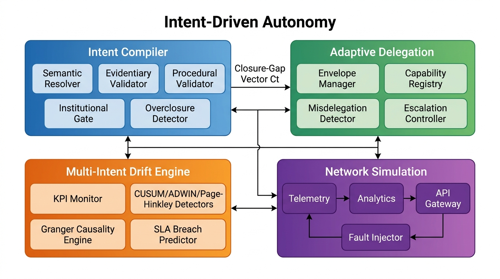
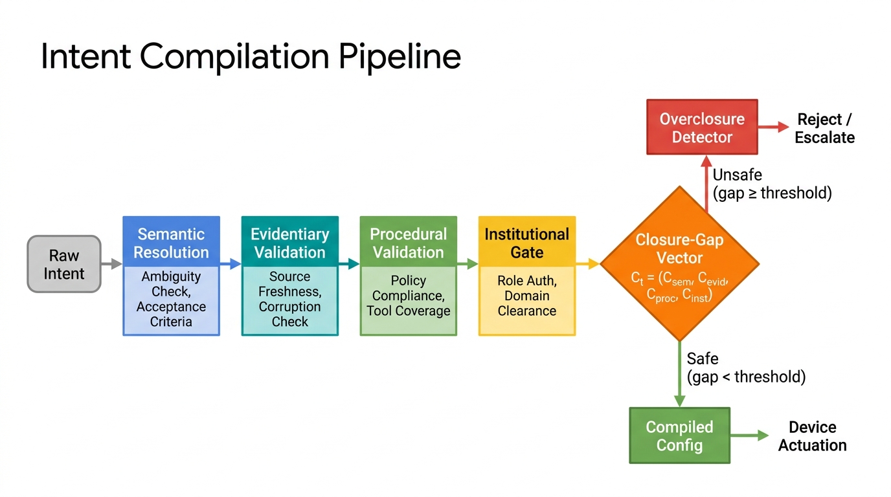
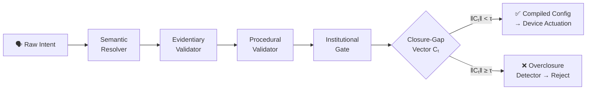
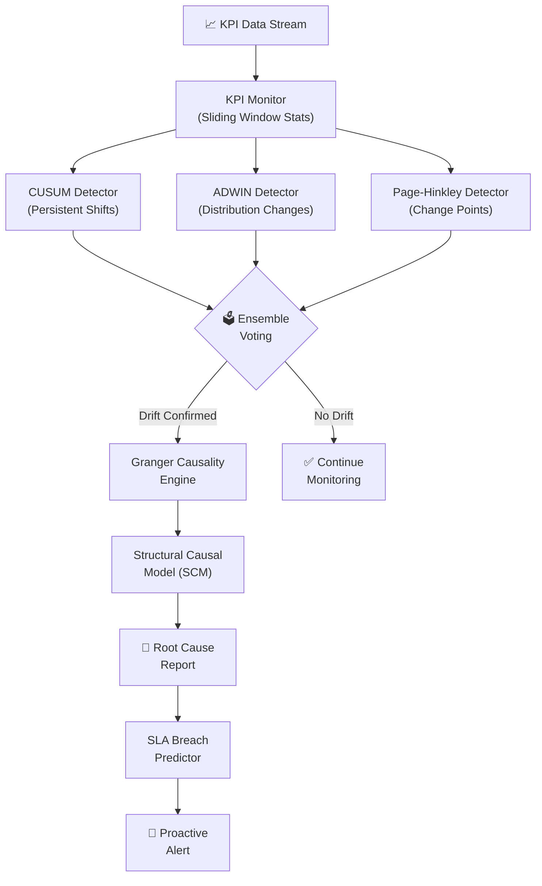
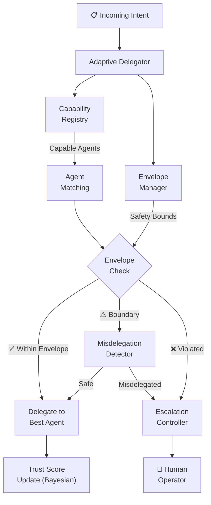
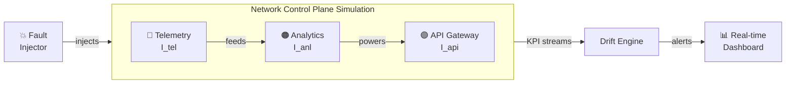

# 🧠 Intent-Driven Autonomy

[](https://www.python.org/downloads/)
[](LICENSE)
[](#testing)
[](.github/workflows/ci.yml)

> **Intent Compilation, Multi-Intent Drift Detection, and Adaptive Delegation Envelopes for Autonomous Intent-Based Networking (IBN)**

---

## 📋 Table of Contents

- [Abstract](#abstract)
- [System Architecture](#-system-architecture)
- [The Closure-Gap Vector](#-the-closure-gap-vector)
- [Intent Compilation Pipeline](#-intent-compilation-pipeline)
- [Multi-Intent Drift Engine](#-multi-intent-drift-engine)
- [Cascading Intent Drift & Causal Co-Drift](#-cascading-intent-drift--causal-co-drift)
- [Adaptive Delegation Envelopes](#-adaptive-delegation-envelopes)
- [Network Simulation](#-network-simulation)
- [Framework Comparison](#-framework-comparison)
- [Installation](#-installation)
- [Quick Start](#-quick-start)
- [API Reference](#-api-reference)
- [Testing](#-testing)
- [Contributing](#-contributing)
- [License](#-license)
- [References](#-references)

---

## Abstract

In autonomous intent-driven environments such as **Intent-Based Networking (IBN)**, real-time agents translate high-level declarative goals into enforceable low-level device configurations. This framework addresses three critical unsolved challenges:

1. **Intent Compilation** — Bridging the gap between unstructured human operational targets and precise actuation parameters before time-to-authorized-action expires
2. **Multi-Intent Drift Detection** — Continuous assurance against subtle, persistent KPI deviations and cascading causal co-drift across dependent intents
3. **Adaptive Delegation** — Dynamic task routing with safety envelopes that prevent misdelegation and overclosure errors

---

## 🏗 System Architecture

<p align="center">
  
</p>

The system comprises four interconnected subsystems:

| Subsystem | Purpose | Key Components |
|-----------|---------|----------------|
| **Intent Compiler** | Translate declarative intents → device configs | Semantic Resolver, Evidentiary Validator, Procedural Validator, Institutional Gate, Overclosure Detector |
| **Drift Engine** | Continuous multi-intent assurance | KPI Monitor, CUSUM/ADWIN/Page-Hinkley Detectors, Granger Causality Engine, SLA Predictor |
| **Delegation Framework** | Safe agent task routing | Envelope Manager, Capability Registry, Misdelegation Detector, Escalation Controller |
| **Simulation** | 3-intent network control plane | Telemetry/Analytics/API Gateway Intents, Fault Injector, Real-time Dashboard |

---

## 📐 The Closure-Gap Vector

The unresolved uncertainty during intent compilation is represented as a **multidimensional closure-gap vector**:

$$C_t = \big( C_{\text{sem},t},\; C_{\text{evid},t},\; C_{\text{proc},t},\; C_{\text{inst},t} \big)$$

| Component | Measures | Failure Mode if Ignored |
|-----------|----------|------------------------|
| $C_{\text{sem}}$ — **Semantic Gap** | Ambiguity in task acceptance criteria | Brittle or incorrect actuation |
| $C_{\text{evid}}$ — **Evidentiary Gap** | Reliance on stale/corrupted context | Reasoning over invalid assumptions |
| $C_{\text{proc}}$ — **Procedural Gap** | Missing validated execution path | Un-auditable side channels |
| $C_{\text{inst}}$ — **Institutional Gap** | Absent role authorization | Irreversible out-of-scope actions |

**Safety condition** — An intent is actionable only when:

$$\|C_t\|_2 = \sqrt{C_{\text{sem}}^2 + C_{\text{evid}}^2 + C_{\text{proc}}^2 + C_{\text{inst}}^2} < \tau$$

where $\tau$ is a configurable safety threshold.

---

## 🔧 Intent Compilation Pipeline

<p align="center">
  
</p>

### Pipeline Stages



**Overclosure Detection** — When agents attempt to minimize computation time by acting on underspecified intents without resolving closure gaps, the overclosure detector flags the risk and prevents premature execution.

---

## 📊 Multi-Intent Drift Engine

The drift engine implements three complementary statistical detection algorithms with ensemble voting:



### Detection Algorithms

| Algorithm | Detection Type | Strength |
|-----------|---------------|----------|
| **CUSUM** | Cumulative Sum control chart | Detects persistent mean shifts |
| **ADWIN** | Adaptive Windowing | Detects distribution changes online |
| **Page-Hinkley** | Sequential change-point test | Detects gradual parameter changes |
| **Ensemble** | Majority voting | Reduces false positives via consensus |

---

## 🔗 Cascading Intent Drift & Causal Co-Drift

A major unsolved challenge is **causal co-drift** — where a root-cause fault propagates through shared infrastructure, generating cascading anomalies across dependent intents.

```mermaid
flowchart LR
    subgraph TEL["🔵 Telemetry Intent (I_tel)"]
        T1["Queue Depth"]
        T2["Throughput"]
        T3["Latency"]
    end
    subgraph ANL["🟠 Analytics Intent (I_anl)"]
        A1["Inference Throughput"]
        A2["Model Latency"]
        A3["Accuracy"]
    end
    subgraph API["🟣 API Gateway Intent (I_api)"]
        G1["Response Latency"]
        G2["Request Rate"]
        G3["SLA Compliance"]
    end

    FAULT["⚡ Queue\nBackpressure\nFault"] -->|"Root Cause"| TEL
    TEL -->|"Degraded\nTelemetry Feed"| ANL
    ANL -->|"Reduced Inference\nThroughput"| API

    style FAULT fill:#ff4444,color:#fff
    style TEL fill:#4488ff,color:#fff
    style ANL fill:#ff8844,color:#fff
    style API fill:#8844ff,color:#fff
```



**Cascade Example:**
1. ⚡ **Queue backpressure fault** in Telemetry → queue depth spikes, throughput drops
2. 📉 **Analytics degrades** → inference throughput drops (depends on telemetry feed)
3. 🚨 **API Gateway breaches SLA** → response latency exceeds thresholds

The **Granger Causality Engine** performs multivariate temporal causality testing (F-test, OLS regression) to disambiguate root causes and trace the causal chain in real time.

---

## 🛡 Adaptive Delegation Envelopes



### Key Features

- **Dynamic Envelopes** — Adapt boundaries based on agent performance history
- **Bayesian Trust** — Trust scores update with each task success/failure
- **Load Balancing** — Prefer least-loaded capable agents
- **Escalation Policies** — Automatic human-in-the-loop for high-risk decisions

---

## 🌐 Network Simulation

The simulation models a **self-driving network control plane** with three interdependent macro-intents:



### Fault Injection Scenarios

| Scenario | Target | Effect |
|----------|--------|--------|
| `QUEUE_BACKPRESSURE` | Telemetry | Queue depth spikes, throughput drops |
| `LATENCY_SPIKE` | Any intent | Sudden latency increase |
| `THROUGHPUT_DROP` | Any intent | Gradual throughput degradation |
| `CASCADE_FAILURE` | Telemetry | Full cascade: Tel → Anl → API |
| `RANDOM_NOISE` | Any intent | Stochastic KPI perturbation |

---

## 📊 Framework Comparison

| Framework | Primary Focus | Verification Mechanism | Unsolved Limitation | Multi-Intent | Causal Reasoning | Real-Time |
|-----------|--------------|----------------------|---------------------|:---:|:---:|:---:|
| **AgentVerify** | Control-flow safety | LTL model checking + FSM monitors | Cannot verify internal neural states | ❌ | ❌ | ⚠️ |
| **OpenClaw** | Runtime governance | Multi-stage admission control | High latency during human takeover | ❌ | ❌ | ⚠️ |
| **MILD** | Multi-intent networks | Causal dependency modeling | KPI state space explosion | ✅ | ⚠️ | ⚠️ |
| **INTA** | Cross-vendor translation | Two-stage retrieval + voting | Conflicting vendor design logic | ⚠️ | ❌ | ❌ |
| **Ours** | **Full-stack IBN autonomy** | **Closure-gap + Granger causality + adaptive envelopes** | **Scalability under extreme multi-intent** | ✅ | ✅ | ✅ |

---

## 🚀 Installation

```bash
# Clone the repository
git clone https://github.com/KasuSathvikaMary/intent-driven-autonomy.git
cd intent-driven-autonomy

# Install dependencies
pip install -r requirements.txt

# Or install as editable package
pip install -e .
```

### Requirements
- Python 3.11+
- NumPy, StatsModels, Plotly, Dash

---

## ⚡ Quick Start

### 1. Compile an Intent

```python
from intent_compiler.models import Intent, IntentStatus
from intent_compiler.compiler import IntentCompiler, CompilerConfig, CompilationContext
from intent_compiler.evidentiary_validator import ContextSource
from intent_compiler.procedural_validator import Policy
from intent_compiler.institutional_gate import AgentRole
from datetime import datetime
import time

# Create an intent
intent = Intent(
    id="intent-001",
    description="Set interface GigabitEthernet0/1 MTU to 9000 bytes for jumbo frame support",
    source="network-ops-admin",
    priority=3,
    timestamp=datetime.now(),
    status=IntentStatus.RECEIVED,
)

# Configure the compiler
config = CompilerConfig(
    semantic_threshold=0.4,
    evidentiary_threshold=0.4,
    procedural_threshold=0.4,
    institutional_threshold=0.4,
    time_budget_ms=5000.0,
    strict_mode=True,
)

# Set up context
context = CompilationContext(
    context_sources=[
        ContextSource(
            source_id="src-1",
            data={"interface": "GigabitEthernet0/1", "current_mtu": 1500},
            timestamp=time.time(),
            reliability_score=0.95,
            is_corrupted=False,
        )
    ],
    available_tools=["cli_configurator", "config_validator", "rollback_manager"],
    policies=[
        Policy(
            policy_id="pol-1",
            name="network-change-policy",
            required_tools=["cli_configurator", "config_validator"],
            forbidden_actions=["shutdown_interface"],
            audit_required=True,
        )
    ],
    agent_role=AgentRole(
        role_id="role-1",
        name="network-engineer",
        authorized_domains=["network", "routing", "switching"],
        max_impact_level=3,
        requires_approval_above=4,
    ),
    target_domain="network",
)

# Compile!
compiler = IntentCompiler(config=config)
result = compiler.compile(intent, context)

print(f"Actionable: {result.is_actionable}")
print(f"Closure Gap: ‖C_t‖ = {result.closure_gap.magnitude():.4f}")
print(f"  Semantic:      {result.closure_gap.semantic:.4f}")
print(f"  Evidentiary:   {result.closure_gap.evidentiary:.4f}")
print(f"  Procedural:    {result.closure_gap.procedural:.4f}")
print(f"  Institutional: {result.closure_gap.institutional:.4f}")
```

### 2. Detect Drift with Granger Causality

```python
from drift_engine.drift_detector import CUSUMDetector, EnsembleDriftDetector
from drift_engine.granger_engine import GrangerCausalityEngine
import numpy as np

# Ensemble drift detection
detector = EnsembleDriftDetector()

# Simulate stable signal then a mean shift
stable = np.random.normal(50, 2, 100)
shifted = np.random.normal(60, 2, 50)  # Mean shift!

for val in stable:
    verdict = detector.update(val)

for val in shifted:
    verdict = detector.update(val)
    if verdict.is_drift:
        print(f"Drift detected! Confidence: {verdict.confidence:.2f}")
        print(f"Triggered by: {verdict.detectors_triggered}")
        break

# Granger causality test
engine = GrangerCausalityEngine(max_lag=5, significance_level=0.05)
x = np.random.normal(0, 1, 200).tolist()
y = [0] * 3 + [x[i-3] * 0.8 + np.random.normal(0, 0.3) for i in range(3, 200)]

result = engine.test_causality(x, y)
print(f"X causes Y: {result.is_causal} (p={result.p_value:.4f}, lag={result.optimal_lag})")
```

### 3. Run the Simulation

```bash
# Run cascading failure simulation
python -m simulation.cli --mode simulate --duration 120 --inject-fault cascade

# Launch real-time dashboard
python -m simulation.cli --mode demo --dashboard

# Run framework benchmarks
python -m simulation.cli --mode benchmark --output results.json
```

---

## 📖 API Reference

### Intent Compiler
| Class | Description |
|-------|-------------|
| `IntentCompiler` | Main orchestrator — compiles intents through all validation stages |
| `ClosureGapVector` | 4D vector `(sem, evid, proc, inst)` with L2 norm and safety checks |
| `SemanticResolver` | Ambiguity detection, acceptance criteria, quantifiability analysis |
| `EvidentiaryValidator` | Source freshness, corruption, and reliability assessment |
| `ProceduralValidator` | Policy compliance and tool coverage verification |
| `InstitutionalGate` | Role authorization and domain clearance evaluation |
| `OverclosureDetector` | Flags premature action on underspecified intents |

### Drift Engine
| Class | Description |
|-------|-------------|
| `DriftEngine` | Main orchestrator — ingests KPIs, detects drift, analyzes causality |
| `KPIMonitor` | Sliding-window statistics and baseline deviation tracking |
| `CUSUMDetector` | Cumulative Sum control chart for persistent shifts |
| `ADWINDetector` | Adaptive Windowing for concept drift detection |
| `PageHinkleyDetector` | Page-Hinkley sequential test for change points |
| `EnsembleDriftDetector` | Multi-detector voting with confidence scores |
| `GrangerCausalityEngine` | OLS-based Granger causality with F-tests |
| `CausalCoAnalyzer` | Structural causal model builder and root-cause tracer |
| `SLABreachPredictor` | Exponential smoothing + linear extrapolation predictor |

### Delegation Framework
| Class | Description |
|-------|-------------|
| `AdaptiveDelegator` | Main orchestrator — routes tasks with safety envelopes |
| `EnvelopeManager` | Computes and adapts safe delegation boundaries |
| `AgentCapabilityRegistry` | Agent registration, capability matching, trust updates |
| `MisdelegationDetector` | Domain mismatch, capability gap, and overload detection |
| `EscalationController` | Human-in-the-loop trigger and resolution tracking |

### Simulation
| Class | Description |
|-------|-------------|
| `NetworkSimulator` | Runs 3-intent control plane simulation with drift engine |
| `TelemetryIntent` | Queuing-theory-based telemetry pipeline simulator |
| `AnalyticsIntent` | Inference pipeline dependent on telemetry health |
| `APIGatewayIntent` | API latency governed by analytics throughput |
| `FaultInjector` | Programmable fault scenarios and cascade templates |

---

## 🧪 Testing

```bash
# Run all 32 tests
python -m pytest tests/ -v

# Run with coverage
python -m pytest tests/ --cov=. --cov-report=html

# Run specific test module
python -m pytest tests/test_drift_engine.py -v
python -m pytest tests/test_intent_compiler.py -v
python -m pytest tests/test_delegation.py -v
python -m pytest tests/test_simulation.py -v
```

### Test Coverage

| Module | Tests | Coverage Areas |
|--------|:-----:|----------------|
| Intent Compiler | 10 | L2 norm, safety checks, semantic resolution, evidentiary staleness, procedural gaps, institutional auth, overclosure, full pipeline |
| Drift Engine | 11 | CUSUM, ADWIN, Page-Hinkley, ensemble voting, KPI deviation, Granger causality (causal + independent), SLA prediction |
| Delegation | 7 | Envelope bounds, capability matching, Bayesian trust, misdelegation, escalation, load balancing |
| Simulation | 4 | Normal operation, backpressure faults, cascading failures, fault scheduling |

---

## 🤝 Contributing

Contributions are welcome! Please:

1. Fork the repository
2. Create a feature branch (`git checkout -b feature/amazing-feature`)
3. Commit your changes (`git commit -m 'Add amazing feature'`)
4. Push to the branch (`git push origin feature/amazing-feature`)
5. Open a Pull Request

---

## 📄 License

This project is licensed under the MIT License — see the [LICENSE](LICENSE) file for details.

---

## 📚 References

1. KasuSathvikaMary (2026). *Intent Compilation, Multi-Intent Drift Detection, and Adaptive Delegation Envelopes for Autonomous Intent-Based Networking.*
2. AgentVerify Framework — Control-flow safety via LTL model checking and FSM runtime monitors.
3. OpenClaw Harness — Runtime governance for embodied agents with multi-stage admission control.
4. MILD Assurance Engine — Multi-intent self-driving network control with causal dependency modeling.
5. INTA Framework — Cross-vendor network configuration intent translation via retrieval and voting.

---

<p align="center">
  <b>Built with ❤️ by <a href="https://github.com/KasuSathvikaMary">KasuSathvikaMary</a></b>
</p>
