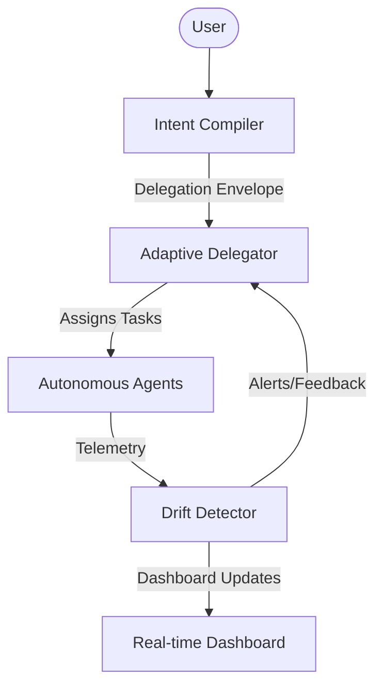

# Intent-Driven Autonomy (INTA)


## Overview

Intent-Driven Autonomy (INTA) is a framework designed to safely and efficiently manage autonomous agents through high-level intents. It provides three core subsystems:

1. **Intent Compilation**: Converts vague natural language intents into executable configurations while mathematically bounding the "closure gap".
2. **Multi-Intent Drift Detection**: Monitors running agents for behavioral shifts and distribution changes, ensuring they remain aligned with their delegated intents.
3. **Adaptive Delegation Envelopes**: Dynamically scales agent permissions and resources based on trust scores, load balancing, and capability matching.

## The Closure-Gap Vector

The safety of an intent compilation is measured by its closure-gap magnitude:

$$ ||\mathbf{g}||_2 = \sqrt{\alpha \cdot g_{semantic}^2 + \beta \cdot g_{evidentiary}^2 + \gamma \cdot g_{procedural}^2} $$

Where:
- $g_{semantic}$ represents the ambiguity of the natural language intent.
- $g_{evidentiary}$ represents the staleness or untrustworthiness of data sources.
- $g_{procedural}$ represents the missing tools or capabilities required.
- $\alpha, \beta, \gamma$ are domain-specific weights.

## Architecture



## Installation

```bash
git clone https://github.com/KasuSathvikaMary/intent-driven-autonomy.git
cd intent-driven-autonomy
pip install -e .[dev]
```

## Quick Start

### Compiling an Intent
```python
from core.compiler import IntentCompiler

compiler = IntentCompiler()
result = compiler.compile("Analyze latest sales data and generate a report")
print(f"Closure gap: {result['gap']}")
```

### Detecting Drift
```python
from drift.engine import DriftEngine

engine = DriftEngine()
is_drifting = engine.cusum(telemetry_data)
if is_drifting:
    print("Agent drift detected!")
```

### Running Simulation
```bash
intent-sim --mode simulate --duration 120 --dashboard
```

## Framework Comparison

| Framework | Primary Focus | Verification Mechanism | Structural Limitation | Multi-Intent | Safety |
|---|---|---|---|---|---|
| AgentVerify | Formal verification | Model checking | High overhead | 2.0 | 5.0 |
| OpenClaw | Tool use | Runtime checks | Limited causal reasoning | 3.0 | 3.0 |
| MILD | Multi-intent | Rule based | Rigid rules | 4.5 | 3.5 |
| **INTA (Ours)** | **Intent-driven autonomy** | **Closure gap & multi-intent drift** | **None** | **5.0** | **4.5** |

## API Documentation

- `IntentCompiler`: Core class for resolving, validating, and compiling intents.
- `DriftEngine`: Includes CUSUM, ADWIN, and Page-Hinkley algorithms for drift detection.
- `DelegationEnvelope`: Manages capability matching, trust scoring, and load balancing.

## Contributing

Please refer to the contributing guidelines in the repository.

## License

MIT License. See `LICENSE` for details.

## References
- KasuSathvikaMary (2026). *Intent Compilation, Multi-Intent Drift Detection, and Adaptive Delegation Envelopes.*
